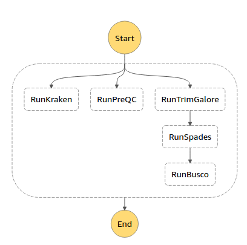

# Single Amplified Genome Assembly on AWS

This project is a fork of [Genomics Research on AWS](https://github.com/aws-samples/aws-batch-genomics), adjusted for working with SAGs. To learn more on how that repo was constructed visit [this excellent blog post](https://aws.amazon.com/blogs/compute/building-high-throughput-genomics-batch-workflows-on-aws-introduction-part-1-of-4/). Since that was published AWS implemented AWS Step Functions integration with AWS Batch, which you can find more about at [Building Simpler Genomics Workflows on AWS Step Functions](https://aws.amazon.com/blogs/compute/building-simpler-genomics-workflows-on-aws-step-functions/). 

This work was additionally based on [this SAG Assembly pipeline](https://www.protocols.io/view/single-amplified-genome-assembly-nccdasw) by Tyler Alioto. I've changed some of the command line instructions, and used different packages where needed.

### NOTE: this is not free tier eligible. The deployment step takes around an hour and cost somewhat less than a dollar. Running the pipeline with the ecoli samples I've provided (same ones used to benchmark [SPAdes](http://spades.bioinf.spbau.ru/spades_test_datasets/ecoli_sc/)) takes around an hour and costs around a dollar as well. 


## PREREQUISITES

* [AWS CLI](https://docs.aws.amazon.com/cli/latest/userguide/installing.html)
* Admin permissions for deployment

## DEPLOY

*Will build and deploy everything needed to run a single amplified genome assembly pipeline on AWS.  This includes:*
1. Custom AMI with 1TB scratch volume using the ECS AMI for your region **(10 min)**
2. A sga - preQC image, that will create a report as well, Kraken, Spades, Busco and trim_galore as Docker images in ECR **(40 min)**
3. AWS Batch queues, compute environments, job definitions and an AWS Step Functions state machine **(10 min)**
4. Roles and buckets needed.

````bash
$ setup.sh 
````

## USAGE

**Run the Workflow**

*Copy the workflow input that was output to the terminal window after the deployment completed.  Use that input to run the pipeline in the StepFunctions console.  You can also find example workflow inputs in the outputs section of the **batch-scgenomics-pipeline** Cloudformation stack.*

**Update Pipeline Stack**

*Deploy changes made to local Cloudformation templates.*

````bash
$ update.sh
````

**Teardown Pipeline Stack**

*Deletes everything except the custom AMI and ECR images.*

````bash
$ teardown.sh
````

## Configuration notes

### General

All of the command line options can be changed by editing the JSON prompted out by setup.sh, the CmdArgs are sent to the tools 'as-is' so refer to their respective user manuals for details.

Make sure you check after running `setup.sh` whether the ECR repositories contain images, if not then a build might have silently failed, in which case look to the 'Systems Manager' service in the AWS console for troubleshooting details.

### Kraken

Kraken downloads only the SILVA database, if you wish to change it, comment line 25 of ./tools/kraken/Dockerfile and remove the comment from line 26 to construct the regular DB. Note that this is a 100 GB database, I have not tested it yet, and it is possible it might cause some issues with disk space, as the root volume of the provided AMI is only 30 GB. A workaround could be to mount /var/lib/docker to a separate volume like we do when building the images.

### Spades

When entering multiple file enter them separated by a comma and a space. Same applies to other multi-file inputs, do not use brackets in your AWS Step Function inputs, it causes an error.

### Busco

Downloads only bacterial datasets due to the same issues as with Kraken and the AMI. A workaround for both could be to run the setup.sh for each tool individually on your local machine, provided that you can configure a local copy of docker to use a separate volume.

### Failures

If a failure occurs make sure you check whether the EC2 instances are still running. The `teardown.sh` script doesn't destroy the AMIs, volumes, or snapshots, so keep that in mind as you will have to delete them yourself.

**Never delete anything other then AMIs, volumes or snapshots by hand!** All other resources are created by CloudFormation, so if you delete them manually then CloudFormation will not be able to rollback the deployment scripts, causing those CF scripts to stay in your CF console panel forever, or until you pay 29$ for customer support, then you could ask them to delete those manually as well.

### Timeouts

All batch jobs are set to time out after one hour to prevent EC2 instances from staying up if after they get stuck into a loop.
